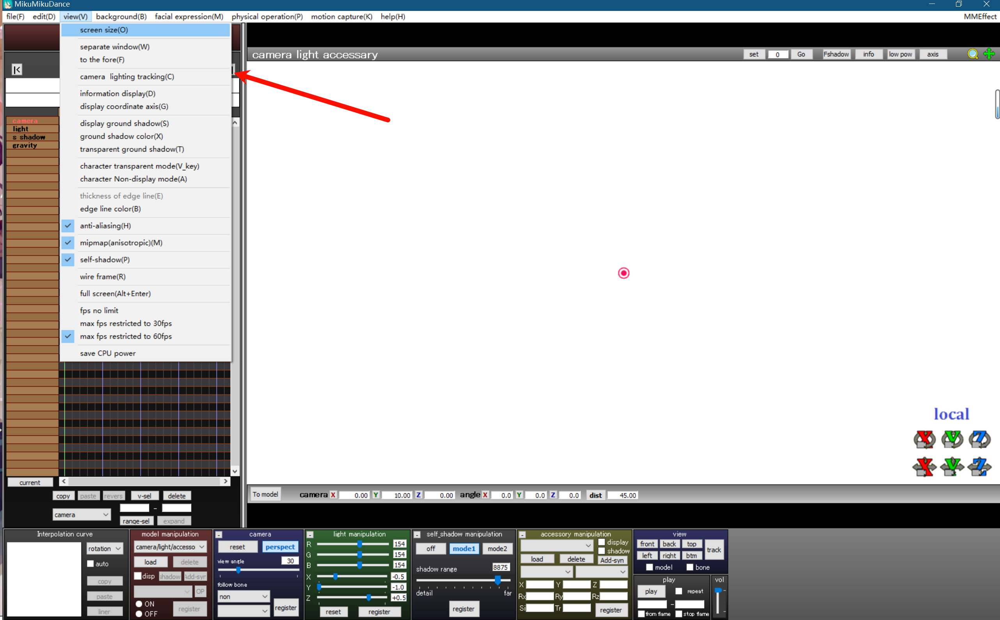
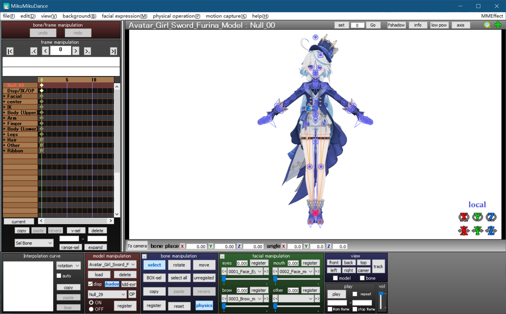
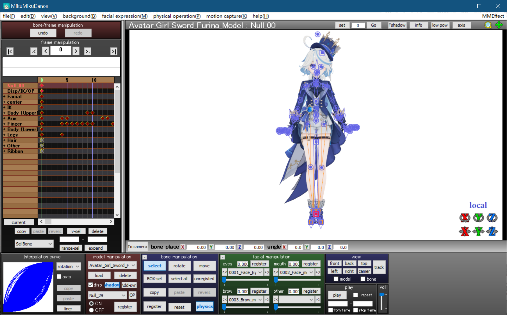
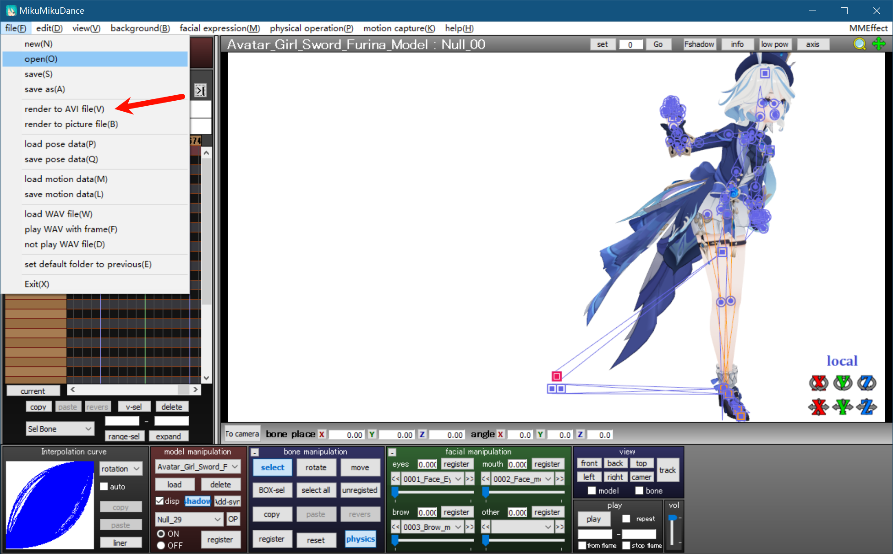
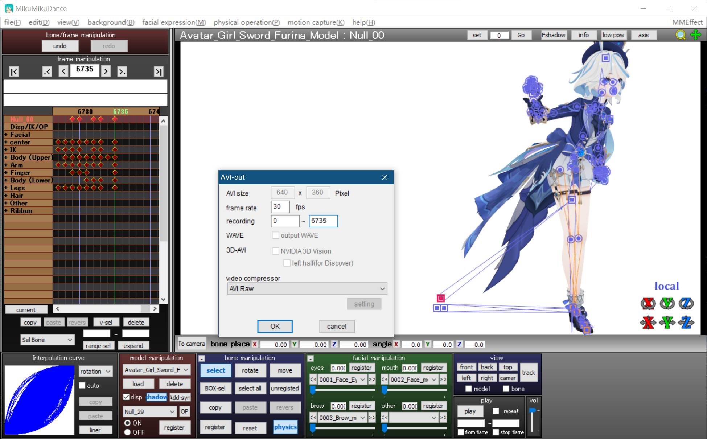
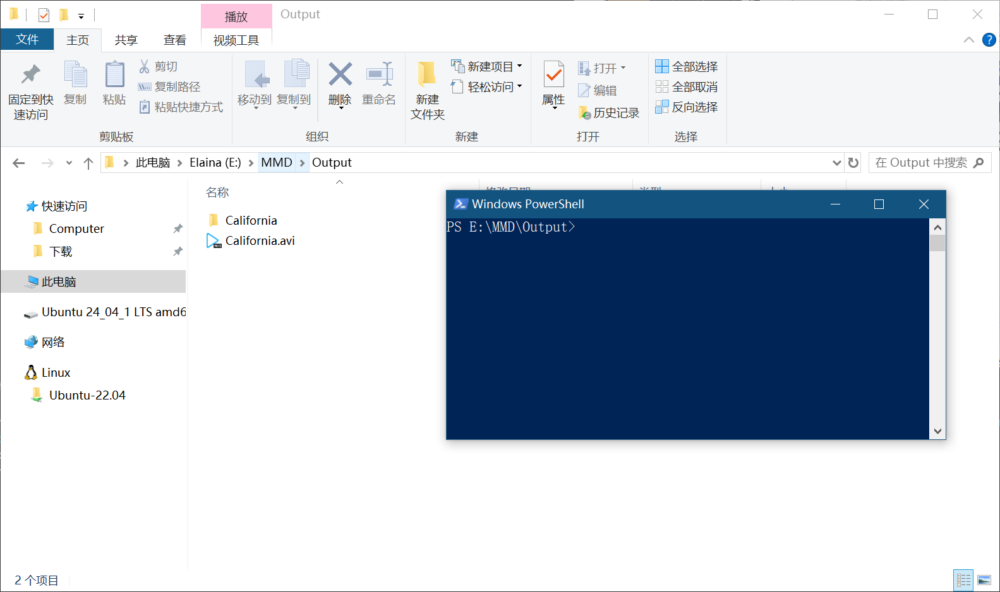
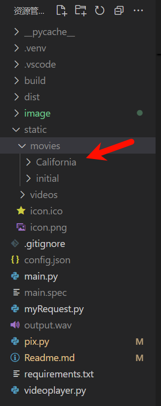
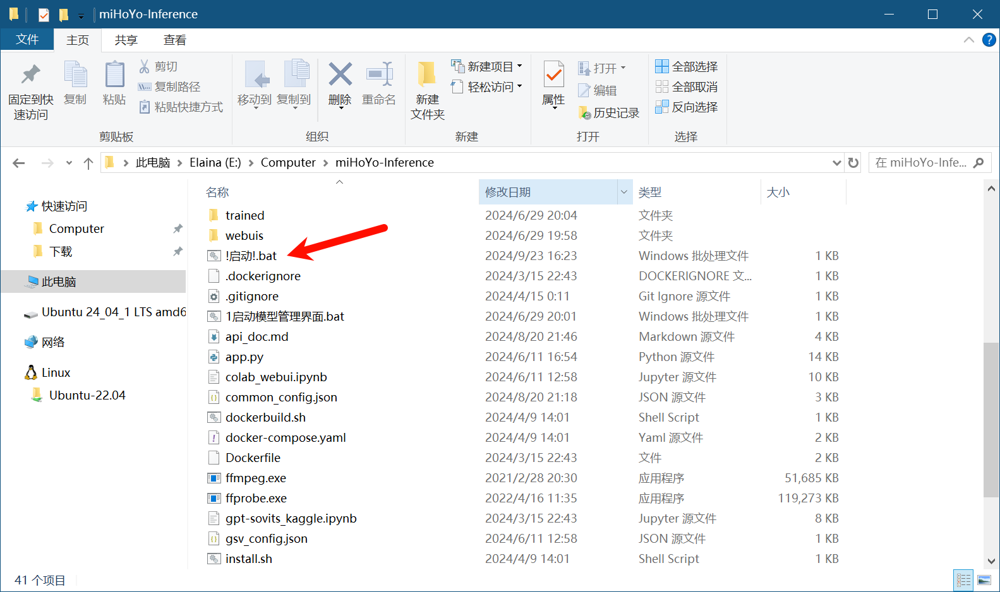

# 制作视频
这个要使用`MIkuMikuDance`这个软件，基础设置如下：



然后将模型拖入软件中



然后再将动作文件（vmd文件）拖入软件中，经过一段时间加载后



然后导出视频



参数设置如下，导出首帧为0，末尾帧为动作的数据长度，分辨率为640x360，帧率为30（分辨率设置在菜单栏的`view`中的`screen size`中）



# 处理视频
进入导出`avi`视频的文件，***先创建一个文件夹与视频同名***，然后按住`shift`+`鼠标右键`，选择`在此处打开Powershell窗口`



输入以下命令：

``` powershell
ffmpeg -i .\视频文件名.avi -t 5 -s 640x360 -r 25 ./视频文件名/%d.png
```
PS：一定要在当前文件夹下创建`视频文件名`这个文件夹，然后运行这个命令，否则会报错

`powershell`命令中`5`是所处理的视频时长，根据实际时长取整数就行，`25`是帧率。

总结所需要改的只有`视频文件名`和`5`这两个地方，其他地方都不需要改动。

处理完成后将音乐以`wav`格式，文件名为`music.wav`放到`视频文件名`文件夹中。

最后将文件夹移动到`static/movies`这个文件夹下，例如这里的`California`和`initial`都是我预先处理好的文件夹。



# 使用
先进入`miHoYo-Inference`这个文件夹，双击`!启动！.bat`文件，等待软件启动。



启动完成后再在python中运行`main.py`文件，本人是在vscode中直接运行。